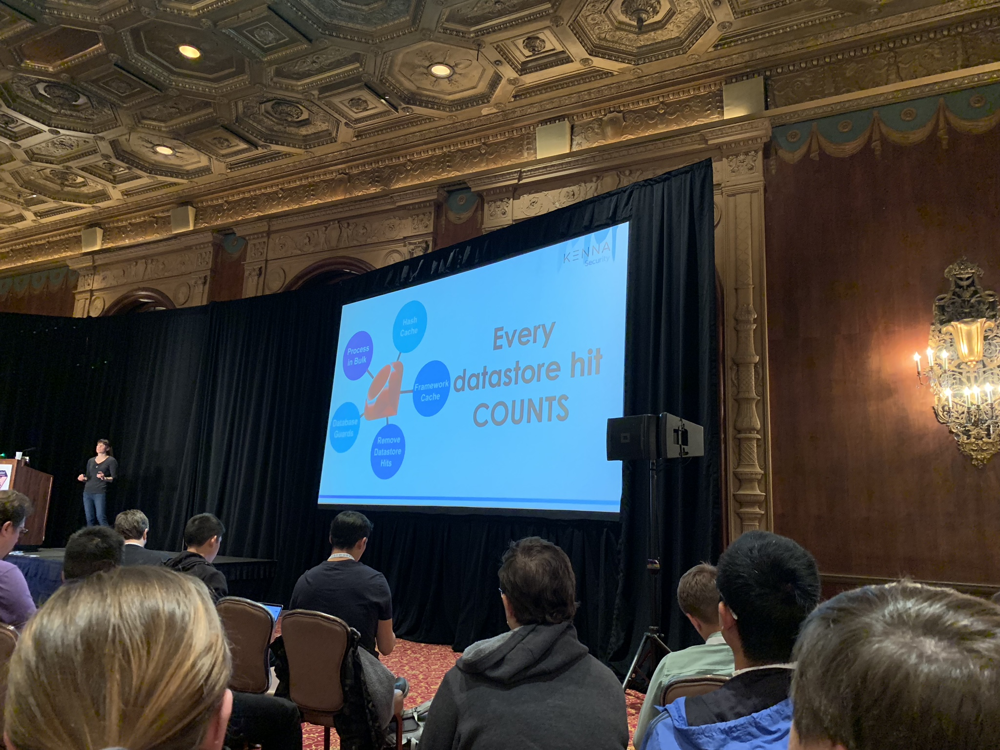

## Cache is King: Get the Most Bang for Your Buck From Ruby

Molly Struve ([@molly_struve](https://twitter.com/molly_struve)) Track: [Make It Faster](https://rubyconf.org/program#track-make-it-faster)

### Intro

Went in a few minutes late.

Gives a life example of caching:

<blockquote class="twitter-tweet" data-lang="en">
Live analog demo of caching by <a href="https://twitter.com/molly_struve?ref_src=twsrc%5Etfw">@molly_struve</a> <a href="https://twitter.com/hashtag/RubyConf?src=hash&amp;ref_src=twsrc%5Etfw">#RubyConf</a>   
&mdash; Valerie Woolard Srinivasan (@valeriecodes) <a href="https://twitter.com/valeriecodes/status/1062856429294342144?ref_src=twsrc%5Etfw">November 14, 2018</a></blockquote>

Gets one of the audience on stage. Asks him about his name, he replies. Asks again. And again. And again.

Asks:

> "How annoyed would you be if I asked you your name one million times?"

The guy replies:

> "I would shut down!"

Asks the guy to write it down instead. Now if she wants to know his name, she no longer need to ask.

That's what caching is like.

### Notes

Talks about the company she works for.

Describes their setup.

Gives an example about how they had a lot of fast queries but they were making so many of them.

Talks about Bulk Serialization.

Describes how they are optimising and caching, especially using bulk serialization.

Shows a graph indicating how better their queries are after deploying that optimisation.

Explains how fixing one part of the problem moved the load to another part: Redis.

Talks about sharding their database.

Moves on to other optimisation techniques to ensure they are not doing unnecessary database hits.

I'm enjoying this.

Goes on to the last point. Bumping up the number of Resque workers from 45 to 70. Redis was overwhelmed as a result.

Explains how they fixed it.

_I probably stopped talking notes at this point to focus on the talk._

Recommendations:

_Sorry about the angle!_ (a better version can be seen [here](https://twitter.com/OmbuLabs/status/1062863469408477185))

- Process in Bulk: if your data can be processed together, it's always going to be faster.
- Hash Cache: is always going to be faster (than Redis, for instance).
- Framework cache (know your gems): understand how your gems are working and configured.
- Database Guards: prevent useless datastore hits.
- Remove Datastore Hits: building on the previous points, sometimes you want to find ways to use Ruby to replace your datastore hits, sometimes you want to use Ruby to prevent useless datastore hits. In other times, you just need to straight up remove the datastore hits you now longer need.

Talk ends.

Awesome talk. Told her in person how much I loved it.

### Slides & Video

Slides is available [here](https://www.slideshare.net/MollyStruve/cache-is-king-get-the-most-bang-for-your-buck-from-ruby-122728558). Video can be found [here](http://confreaks.tv/videos/rubyconf2018-cache-is-king-get-the-most-bang-for-your-buck-from-ruby).

She is also publishing this talk as a series of blog posts:

<blockquote class="twitter-tweet" data-lang="en">
Started breaking down my <a href="https://twitter.com/hashtag/rubyconf?src=hash&amp;ref_src=twsrc%5Etfw">#rubyconf</a> speech into blog posts 😃 First up, how to prevent useless database hits using ruby! <a href="https://twitter.com/hashtag/ruby?src=hash&amp;ref_src=twsrc%5Etfw">#ruby</a> <a href="https://twitter.com/hashtag/rails?src=hash&amp;ref_src=twsrc%5Etfw">#rails</a> <a href="https://t.co/Hj6MSUZOwq">https://t.co/Hj6MSUZOwq</a>
&mdash; Molly Struve (@molly_struve) <a href="https://twitter.com/molly_struve/status/1074672870859644929?ref_src=twsrc%5Etfw">December 17, 2018</a></blockquote>

### Q&A

1. **Q**: Did your team has any issues with caching invalidation?

   **A**: Make sure when you're adding something to a cache, everything has an invalidation.

2. **Q**: Are you keeping a local cache on every instance (on a load-balanced environment)?

   **A**: Didn't catch the answer.

3. **Q**: Is there a way you can automatically detect where you ...

   **A**: [... couldn't hear the answer]

4. Couldn't catch the question or the answer.
