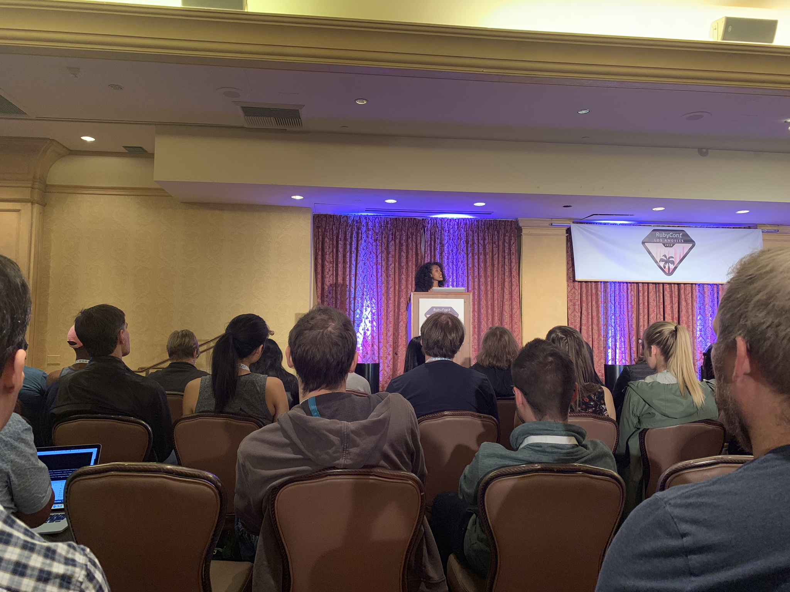
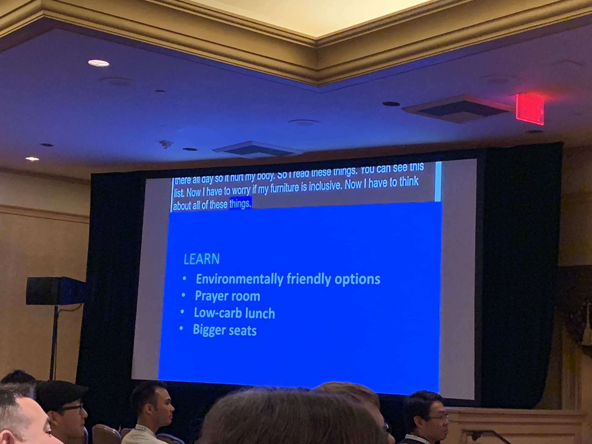

## Keynote: How to build a magical living room

Saron Yitbarek ([@saronyitbarek](https://twitter.com/saronyitbarek))

#### About (extracted from RubyConf website)

Saron is a developer and founder of CodeNewbie, the most supportive community of programmers and people learning to code. She hosts the CodeNewbie Podcast, the Command Line Heroes podcast from Red Hat, and co-hosts the basecs podcast with Vaidehi Joshi.

### Intro

Talk is about: building engaged and authentic communities.

Her childhood. Born Ethiopian, in Addis Ababa.

### Notes

Talking about her father, his ideas about education and interactions with him.

Moves to the immigrant ethiopian community and how her mother were helping gather them in her family's living room.

Talks about how their living room was magical. What her mother did. Thanksgiving.

Her mother were taking notes, and observing and making sure they everyone felt welcome, wanted and safe, this is pretty much resembles how we should be building products.

When she grow up, she started learning to code, went to a bootcamp.

Bootcamps are expensive, they are inaccessible (an investment). That's why she started CodeNewbie.

Talking about CodeNewbie Twitter chat, and its rules.

- Be helpful
- Be supportive

Being aggresively nice with people, giving examples.

More story-telling about the Twitter chats (funny stuff though) and how timezones are preventing people in other parts of the world from participating:

<blockquote class="twitter-tweet" data-lang="en">
&quot;Developers and twitter chat organizers have one common enemy: Timezones!&quot; – <a href="https://twitter.com/saronyitbarek?ref_src=twsrc%5Etfw">@saronyitbarek</a> <a href="https://twitter.com/hashtag/rubyconf?src=hash&amp;ref_src=twsrc%5Etfw">#rubyconf</a>
&mdash; Ahmed (@ahazem) <a href="https://twitter.com/ahazem/status/1062765058600517632?ref_src=twsrc%5Etfw">November 14, 2018</a></blockquote>

This brought the idea of creating a podcast.

Giving some examples of very famous developers who got into coding not very early in their lives, like Yehuda Katz (at 25).

> "Who are developers? There are two main narratives – you went to a top school for CS, you work for a big tech company, you're set for life. Or you were born with a computer in your room. And there are people who aren't those people! Let's talk to them!"

Talking further about how she runs the podcast.

Some background into BaseCS podcast with Vaidehi Joshi.

How they introduced transcripts because someone asked for them, if he hadn't, they wouldn't have had them.

Talks about her making a conference for Newbies: "CodeLand".

Conferences should be financially accessible. They are not, giving examples. Flights / Hotel / Ticket.

They offered in CodeLand an opportunity scholarship to get around this.

Her learnings from organizing CodeLand 2018:

- Closed captions
- Childcare
- Dietry restrictions
- Stickers for photography/privacy

Talks about further feedback she got from attendees:

- Environmental friendly options
- Prayer room
- Low-carb lunch
- Bigger seats

Community building:

- Understanding
- Listening
- Learning
- Iterating

### Video

Video is available [here](http://confreaks.tv/videos/rubyconf2018-keynote-how-to-build-a-magical-living-room).

### Q&A

[no time for questions]
