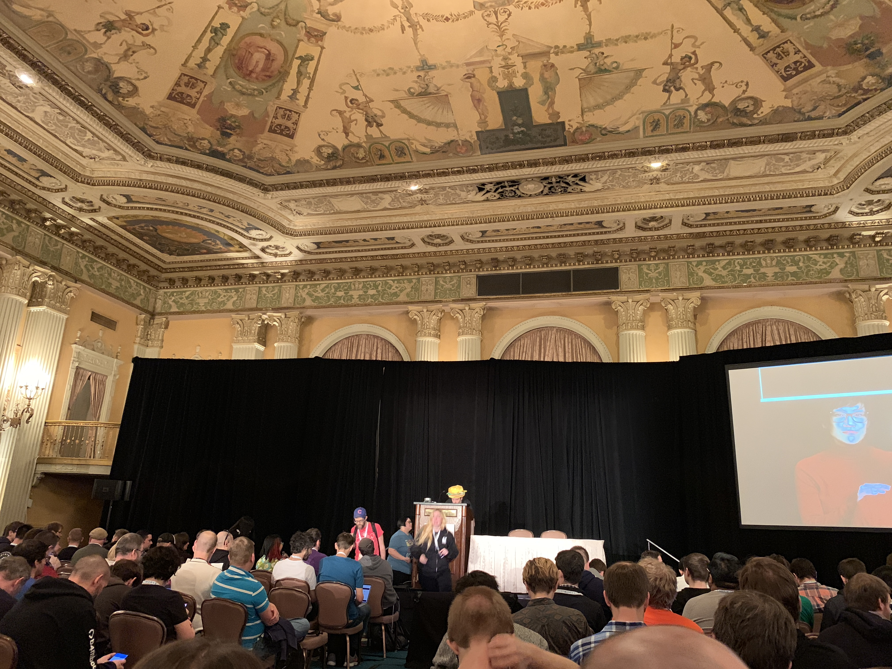

## Pointers for Eliminating Heaps of Memory

Aaron Patterson ([@tenderlove](https://twitter.com/tenderlove)) Track: [Inside Ruby](https://rubyconf.org/program#track-inside-ruby)

### Intro

Room full packed. Aaron on stage, wearing a hamburger hat on his head.

Talks about the hamburger hat, reads the talk title.

### Notes

Laughs.

Jokes about @searls' `standard` gem.

Jokes about the gem being an opinionated version of rubocop: you install it but can not configure it. Laughter.

Asks everybody to install it:

`gem install standard`

Jokes about his cats' names.

Jokes about Microsoft acquiring Github.

Keeps throwing jokes, people laugh.

Some git puns.

Reducing memory usage in Ruby: two optimizations for Ruby 2.6.

Talks about two patches he made to Ruby:

- Loaded Features Cache
- Direct ISeq Marking

Explains how he analyze memory usage in ruby using "Malloc Stack Tracing".

Shows a chart showing top 20 allocators (calling malloc) in a Rails application.

Explains loaded features (array including all required files in a Ruby program).

Talks about internals of loaded features caching.

Moves on to the next optimization.

At this point, I decided to focus more on listening to the talk.

[.. many slides later ..]

Talk ended.

Great talk, very informative, detailed, yet concise.

### Slides & Video

Slides can be found [here](https://speakerdeck.com/tenderlove/reducing-memory-usage-in-ruby). Video is [here](https://confreaks.tv/videos/rubyconf2018-pointers-for-eliminating-heaps-of-memory).

### Q&A

[no questions time]
