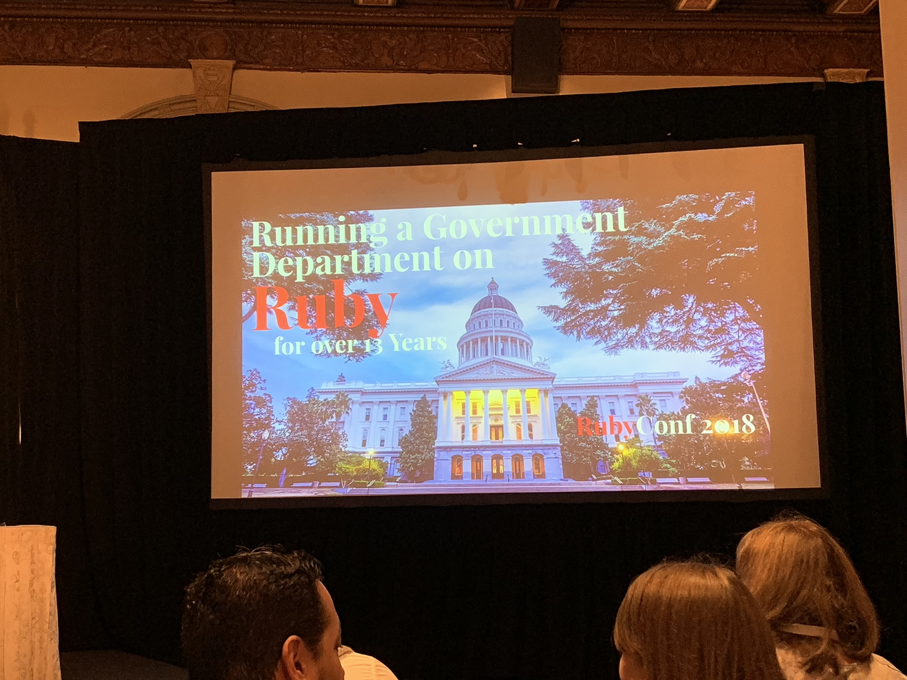

## Running a Government Department on Ruby for over 13 Years

Jeremy Evans ([jeremyevans0](https://twitter.com/jeremyevans0)) 
Track: [General](https://rubyconf.org/program#track-general)

### About (extracted from Rubyconf website)

Jeremy Evans is the lead developer of the Sequel database library, the Roda web toolkit, the Rodauth authentication framework, and many other ruby libraries. He has contributed to CRuby and JRuby, as well as many popular ruby libraries. He is the maintainer of ruby ports for the OpenBSD operating system.

### Intro

Introduces himself. He's the maintainer of some famous open source projects, like Sequel, Roda, and RodAuth.

The talk is about using Ruby for the last 13 years in goverment projects.

### Notes

Talks about why he's maintaining these libraries and how they are being used in his work at the California State Auditor.

Explains that the talk is not about typical government software development practices in other states or countries.

Government software projects are usually large projects, they need approval processes, with a median time of over a year.

After approval, they start by preparing a request for proposal.

After reviewing proposals and accepting one, they give the contract to one of the contractors.

Talks about how software developed for government is often tested:

> "No unit testing of any kind, good integration testing coverage but performed manually via a checklist".

Explains that levels of oversight in a project is multiple and huge.

Goes into the approach they use at his department.

_Image courtesy of [@compiledwrong](https://twitter.com/compiledwrong/status/1062776531733250048)_

- Avoids building large systems: starting simple.
- Scope reduction: getting rid of things unnecessary.
- No contractors: all work done by government employees.
- Ruby-only: all internal customer development is done in Ruby.
- Minimal oversight: little amount of oversight during the development process.
- Tests: automated (at model and web level).
- Reviews: code reviews, stackholder reviews.

Typical projects they work on is transforming paper-based forms to electronic forms.

Gives more details into what systems and projects they're internally working on.

I kind of lost interest at that point.

Talks about their authentication system.

More slides about the things they do with Ruby. Nothing about how they do that in specific though.

Discusses his journey learning Rails/Sinatra and Cuba (which he forked to create Roda), using them in work, and now talks about different tools and technologies they are using.

Javascript is avoided.

Talks about recruiting issues (finding Ruby developers with no Rails experience).

<blockquote class="twitter-tweet" data-lang="en">
&quot;Government work doesn&#39;t pay very well, so having a fun language like ruby to work with helps a lot with retention!&quot; <a href="https://twitter.com/jeremyevans0?ref_src=twsrc%5Etfw">@jeremyevans0</a> <a href="https://twitter.com/hashtag/rubyconf?src=hash&amp;ref_src=twsrc%5Etfw">#rubyconf</a>
&mdash; compiledwrong (@compiledwrong) <a href="https://twitter.com/compiledwrong/status/1062784671728029696?ref_src=twsrc%5Etfw">November 14, 2018</a></blockquote>

Also, about his role as an information security officer at the department.

Talks about their "Defense in Depth" approach:

- Reduced database privileges
- Separate users
- Security definer database functions
- Ingress/Egress/Loopback Filtering
- Chroot priv-drop (chroot doesn't work will with autoload)
- System call filtering

<blockquote class="twitter-tweet" data-lang="en">
Good idea: Reduce the database user permissions to the minimum necessary to limit what an attacker can do <a href="https://twitter.com/hashtag/RubyConf?src=hash&amp;ref_src=twsrc%5Etfw">#RubyConf</a>   
&mdash; Stephanie Wilkinson (@stephanieblack) <a href="https://twitter.com/stephanieblack/status/1062782728506986501?ref_src=twsrc%5Etfw">November 14, 2018</a></blockquote>

Gave some security recommendations, felt a bit unorganized, all related to points mentioned above.

Talks ends.

### Side notes

I spoke to him later in the day before the closing keynote, told him I admired his work (I used to use Sequel and Roda in my previous job) and he was happy about it. Also told him I felt the talk was not detailed enough, and we had a good chat about that.

### Video

Slides is found [here](http://code.jeremyevans.net/presentations/rubyconf2018/index.html). Video is [here](http://confreaks.tv/videos/rubyconf2018-running-a-government-department-on-ruby-for-over-13-years).

### Q&A

1. **Q**: How did you get everybody (for instance, your manager) to buy in?

   **A**: Convinced him to use Ruby, by giving comparison of how the code looked: PHP vs Rails.

2. **Q**: Number of applications developed in one cycle (9 months)?

   **A**: Not really a high volume of applications.

3. **Q**: How do you handle version upgrades in multiple applications?

   **A**: Done once a year: upgrade version, run tests, and see if something breaks, fix them and go to production.

4. **Q**: Is there any restrictions on open sourcing the applications you're building?

   **A**: Replies about the stack being open source (the tools themselves used, not the applications, I think he misunderstood the question).
