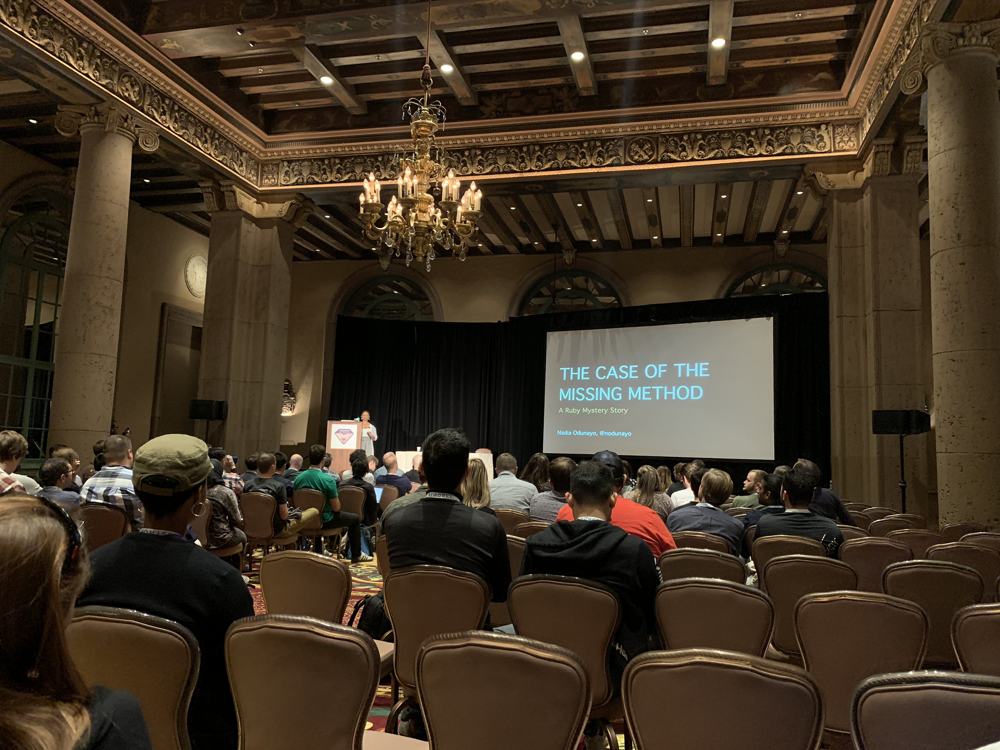

## The Case of the Missing Method — A Ruby Mystery Story

Nadia Odunayo ([@nodunayo](https://twitter.com/nodunayo) Track: [General](https://rubyconf.org/program#track-general)

### About (extracted from RubyConf website)

Nadia is currently CTO at CodeNewbie. Before that, she co-directed Ignition Works, a company that did a mix of in-house product development and software consultancy, helping large firms to manage their cloud platforms.

She previously worked at Pivotal and originally learnt to code at Makers Academy in London. She maintains speakerline.io in her spare time.

### Intro

Talks about herself.

Tosses a few jokes. Laughter.

### Notes

Introduces fictional developer characters: Jenny and Mike.

Goes into story-telling mode, talking about solving the mystery of ruby's missing method.

Talks about instance objects / class instances.

Keeps discussing how class methods work.

Talks about smalltalk:

> "All languages which have been inspired by Smalltalk included their own concept of meta-class."

Explains the difference between `singleton_class` and a `meta class`

Goes back into story-telling.

Cleverly gives an example of writing a simple DSL to explain the use of `singleton_class`.

Talk ends.

Overall, I thought it was a funny talk and I loved it.

### Video

Video is available [here](http://confreaks.tv/videos/rubyconf2018-the-case-of-the-missing-method-a-ruby-mystery-story).

### Q&A

[didn't take questions in public, asked people to come up to her]
