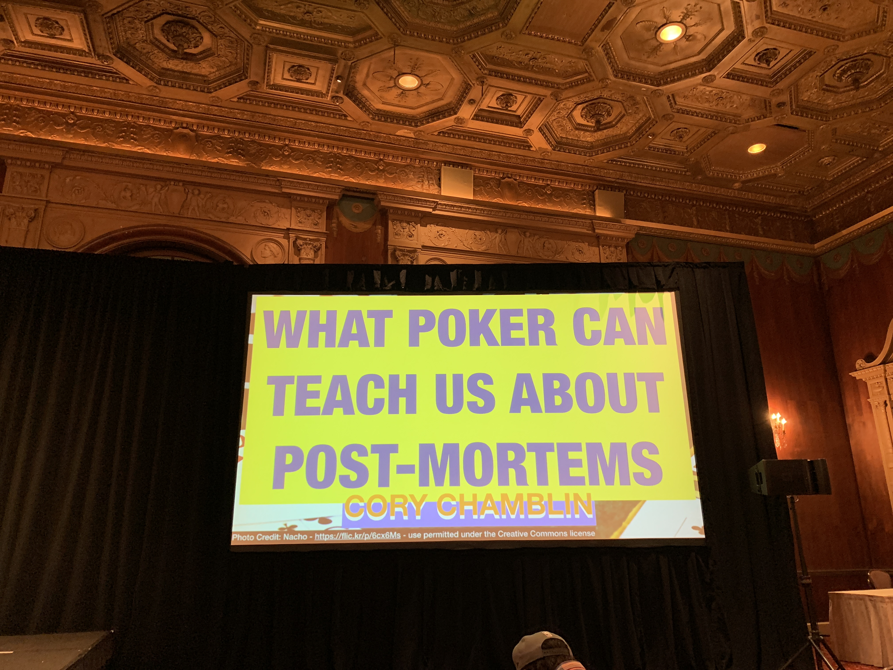

## What poker can teach us about post-mortems?

Cory Chamblin ([@chamblin](https://twitter.com/chamblin)) 
Track: [Incident Response](https://rubyconf.org/program#track-incident-response)

### About (extracted from Rubyconf website)

Cory builds backend software at PagerDuty, but in his spare time he likes to play and think about games.

### Intro

Asks about how many people played Poker.

Jokes about how he caused a number of post-mortems. Laughter.

### Notes

Learning about poker can help us mitigate risks and how we mess up postmortems because we don't think of them like a poker player.

What is poker like? Explains poker rules.

No limit hold'em is the most popular variant of poker today. Givens a high level overview of how it is played.

Cards comes as they will, the only options you really have is to fold or raise.

Lots of details about how the game is played.

Keeps talking about poker, and how you could possibly do different things.

What can we learn from all of that in post-mortems?

I lost track of him.

Gives some analogy related to StarTrek and how their team would hypothetically do a post-mortem/poker game.

Laughter.

Questions for more effective post-mortems:

1. Should we have prevented this?

Not all outages/problems are worth preventing.

2. Should we try to prevent this in the future?

We now know better, stakes had changed, so answer is not yes all the time.

3. Did we understand this risk upfront? Or was it an emerging thing?

Not every time you will know about outages and why they happen, but perhaps you can focus maybe on areas more obsecure and try to shed light on them.

4. How should our decision making change in the future?

[...couldn't follow as I was still writing things from earlier answers]

Talks about life lessons we can learn from poker as well.

Gives a recap of the talk.

Lost interest again in the last couple of slides.

### Slides & Video

Slides is [here](https://chamblinnet.files.wordpress.com/2018/11/what-poker-can-teach-us-about-post-mortems.pdf). Video is available [here](http://confreaks.tv/videos/rubyconf2018-what-poker-can-teach-us-about-post-mortems).

### Q&A

No time for questions.
