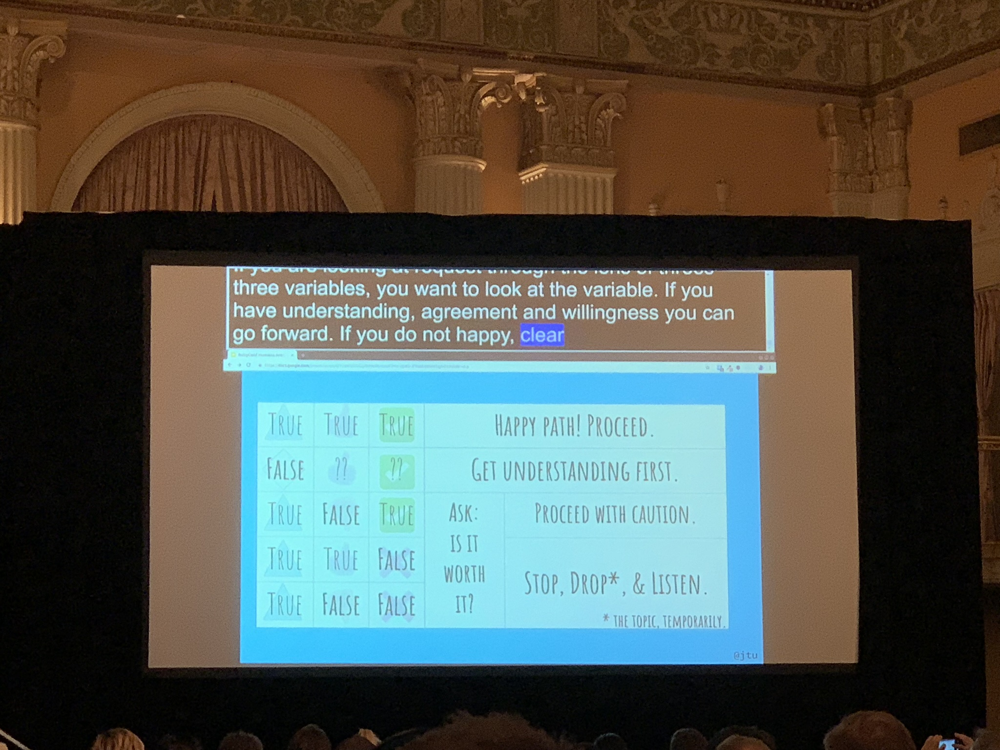
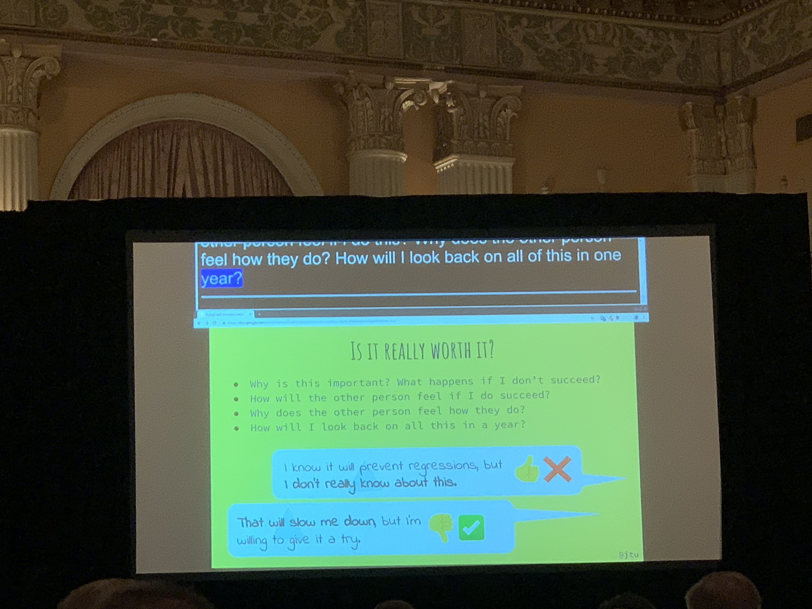
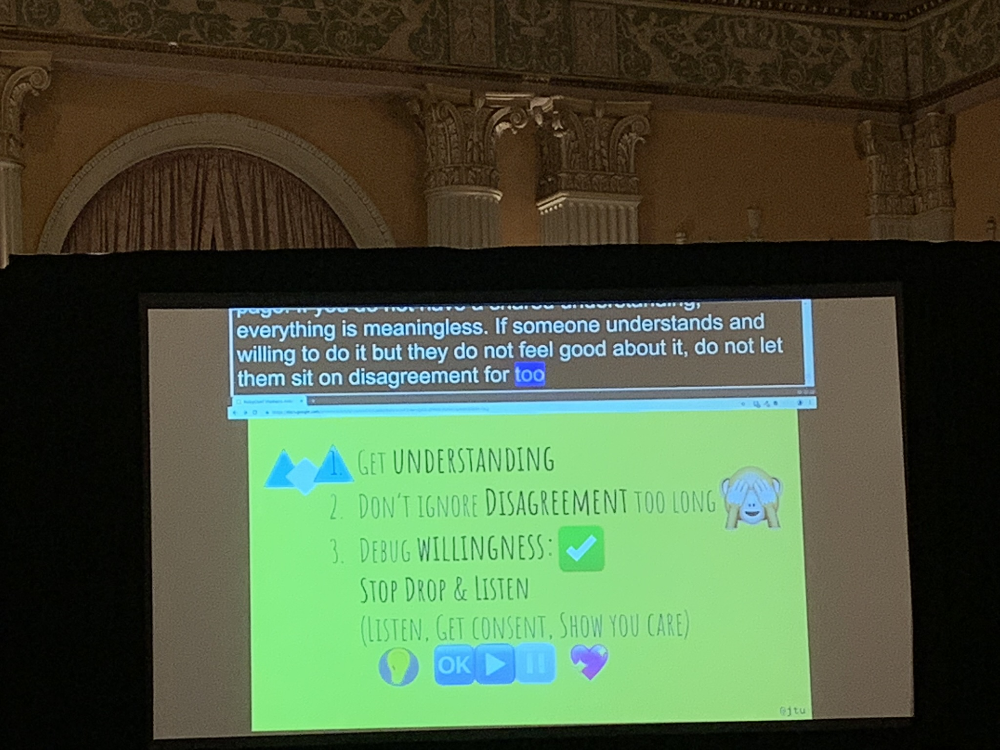

## Humans Aren't APIs And Your Request Is 400 Denied

Jennifer Tu ([@jtu](https://twitter.com/jtu)) Track: [Lead Rubyist](https://rubyconf.org/program#track-lead-rubyist)

### About (extracted from RubyConf website)

In her work life, Jennifer Tu writes code and listens very intently to people. She co-founded Cohere (wecohere.com) to continue to pursue these two interests. Outside of work, she studies martial arts. Jennifer spends her commutes after class reflecting on the parallels between teaching martial arts and communicating in the world of software.

### Intro

Jumps into the talk directly. Shows an illustration either showing a duck or a rabbit.

Asks who see which.

I see a duck.

She introduces herself.

### Notes

Talk is about perspective.

Starts by talking about communication, relates that to http requests / requests in general.

Uses the illustration to talks about perspectives and perhaps not looking at a denied request (like for a request to your colleagues) as a failure, but maybe as a start of a dialouge.

How we can turn a denied request to a successful one?

Goes through an example: asking colleagues to add unit tests to every change request.

Three variables determine how successful a request might be:

_Image courtesy of [@etagwerker](https://twitter.com/etagwerker/status/1063153067477032960)._

- Understanding: the message was received successfully.
- Agreement: if they agree, then they think the request is a good idea.
- Willingness: they'll change their behaviour to match what they believe that request to be.

Briefly goes through the happy path, showing an example dialouge and what could possibly be said.

Explains the many other paths this dialouge could go.

Goes through different scenarios one by one, giving bad and good examples of what to do / do not.

Takeaways:

- Get understanding first: make sure they understand your request.
- Don't procrastinate agreement: you need them to agree, don't wait for that.
- Ask: it is worth it?
- Stop, drop (the topic temporarily), and listen.

Goes into the stop/drop/listen point into more detail, showing different illustrations on what to do, based on external factors (life or work) and past factors (past conversations).

And last but not least, if you're asking somebody to make a change, make it easier to make that change, quoting a phrase often said about refactoring:

> "Make the change easy, then make the easy change."

Giving tips on how to be a good listener.

Weighs between running away from the topic, and also not listening to your colleagues or care about them.

Recaps.

Talk ends. I liked the format of the talk, very informative and engaging.

### Video

Video can be found [here](https://confreaks.tv/videos/rubyconf2018-humans-aren-t-apis-and-your-request-is-400-denied).

### Q&A

[asks people to send her questions via twitter, or coming up to her]
