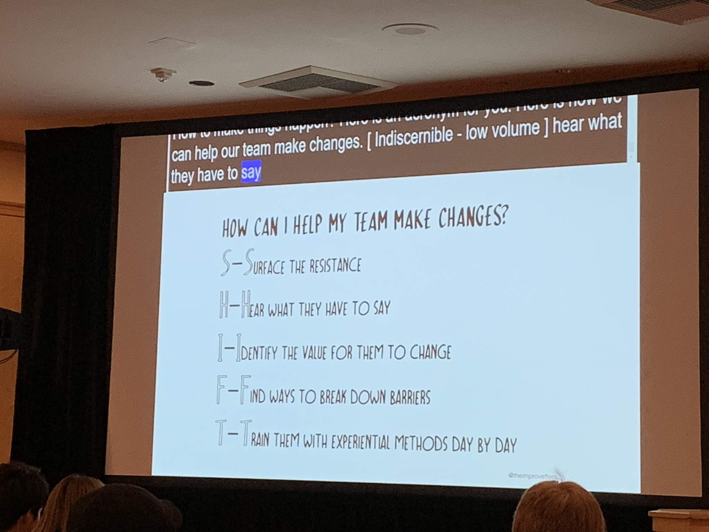

## Keynote - Unlearning: The Challenge of Change

Jessie Shternshus ([@theimproveffect](https://twitter.com/theimproveffect))

### About (extracted from RubyConf website)

Jessie is the owner of The Improv Effect, which she founded in 2007, with the goal of helping businesses reach their full potential by means of interpersonal-communication skills training.

Throughout the years, Jessie has become a key player in internal culture transformations for global companies such as Skype, Groupon, Netflix, Johnson & Johnson, Getty Images, Capital One, Crayola and many more (including some awesome Ruby shops...).

Jessie established herself as a sought-after speaker, and has delivered keynote talks in conferences around the globe. She is also the co-author of “CTRL Shift. 50 Games for 50 ***Days Like Today;” and is currently working hard on releasing her second book.

### Intro

Asks how's everyone is doing.

Talk is about the challenge of change.

### Notes

Doing an excerise together. Explains the game. Audience does the game with her.

Moves to talk about herself and her company. Started 11 years ago.

Talks about unlearning and how that makes a room for us to learn new things.

Story-telling about her trip to Australia.

> "Shift is a way of life!"

Levels of unlearning:

- Individual
- Group
- Organization

Gives some examples of unlearning, whether they are habits or not.

Talks about the saying:

> "It's like riding a bike"

And shows a video about how difficult riding a bike can be in reality (given that the handlebars were inverted).

Talks about adult vs child ability to unlearn.

Relates that to newbies:

> "Newbies have something very valuable to contribute".

Gives more examples from people she worked with at her company.

Asks people to do another game (this time in pairs): "Space Numbers".

Audience does. Good vibes.

Describes how learning is done in the brain: "basal ganglia".

Let's get personal.

Talks about a job she took where she had to teach visually impaired people. How she initially precieved this to be a very hard task and how she was suprised it was not.

Talks about the bathroom signs.

Shows more signs. Asks people to unlearn them (say new meanings).

Goes into unlearning for organizations.

Gives a few recommendations for doing a SHIFT (or how to help your team make changes?):

- [S]urface the resistence.
- [H]ear what they have to say.
- [I]dentify the value for them to change.
- [F]ind ways to break down barriers.
- [T]rain them with experimental methods day by day.

Asks the audience to write something on a white paper, and make an airplane out of it.

Everybody throw their planes.

Now asks some people to read the things on the one they have got.

Different people read planes they've got landing close by.

Moves on to the learnings.

Figure out:

- How to change the habits.
- How to change the mindsets.
- Bring an outsider's prespective (giving an example about food waste with her daughter).
- Curiosity / Expermentation / Play (talks about Escape Thinking).
- Conduct unlearning reviews.

Talks about her book (CTRL Shift).

Talk ends.

### Video

Video is available [here](https://confreaks.tv/videos/rubyconf2018-keynote-unlearning-the-challenge-of-change).

### Q&A

[no time for questions]
