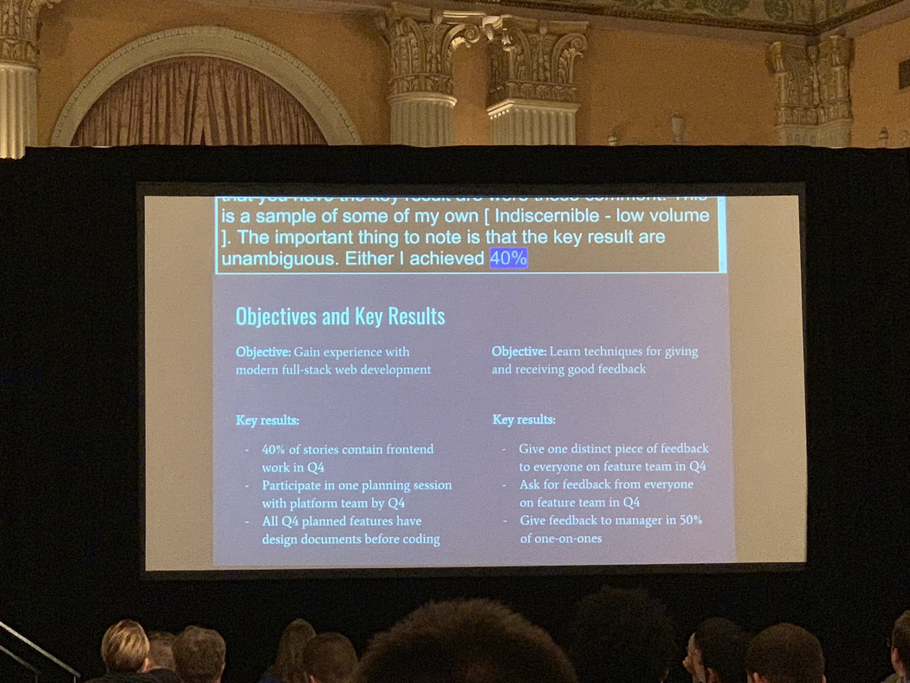

## No Title Required: How Leadership Can Come From Anywhere

Jim Liu ([@jimeister](https://twitter.com/jimeister)) Track: [Lead Rubyist](https://rubyconf.org/program#track-lead-rubyist)

### About (extracted from RubyConf website)

Jim thought about being a doctor, a consultant, and going to business school before finally settling on the tech industry. He hasn't looked back and has worked for a decade for companies in Seattle and the Bay Area. Currently a senior engineer at Gusto, working on the payroll team.

### Intro

Goes directly into talk.

### Notes

Asks: "Why do we want to be leaders?"

Reasons why one would want to be a leader:

- Money
- Influence

Explains his opinions about leadership:

> "It's a personal journey."

There's no certain amount of experience or work that equates to leadership. It's something very personal.

> "It's about people, not code."

Gives some reflection on this from talking to his manager. How does your work affect others?

> "It's about the how, not just the what."

Explains how effective leadership is not just about writing code, but is also about the "soft skills".

So how can we define leadership?

> "Leadership is the continuous practice of positive influence".

Gives some background about his first job, at Microsoft, then going back to college for Masters degree.

Then a story from his participation in a startup weekend event.

Observations he had over the years:

- Leadership != title: simply put, title does not mean "ability to lead".
- Incentives and values: both affect the type of leadership emerging in an organization.
- Someone will see my good work: more often than note does not happen – the best leaders are also the best advocates for themselves.
- Busy work: good leaders always knew what is the most impactful work to be doing at any moment. They cut through "busy work".

Things you could do:

- Don't talk, listen.
- Self-assessment.
- Feedback.
- Dive deep, but not always.

Gives an example for each.

I lost interest for a while.

Mentions non-technical aspects of leadership, talks about them, gives an example of how to structure metrics.

It's a cycle: self-assess -> measure -> dive deep -> feedback.

Moves into mentorship.

> "Don't ignore physical and mental health".

Talks about the biggest problem doing all of that: Time.

Managers should empower us, not just delegate to us. We should hold our organizations accountable.

Talks ends.

### Slides & Video

Slides are available [here](https://docs.google.com/presentation/d/16D8qIrvlBG99CX60u7H397RAbu_GK30XMRDH6Y2LMBc/edit#slide=id.p). Video is available [here](https://confreaks.tv/videos/rubyconf2018-no-title-required-how-leadership-can-come-from-anywhere).

### Q&A

[taking questions in private]
